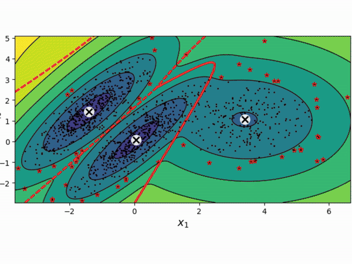

  

<h1>
  Hi there!
  
</h1>

<table>
  <tr>
    <td>
      <h3>Data Viz</h3>
      
    </td>
    <td>
      <h3>Machine Learning</h3>
      
    </td>
    <td>
      <h3>Computer Vision</h3>
      
    </td>
  </tr>
</table>
---

### :man_technologist: About Me :
I am an Electronic Instrumentation Engineer specializing in AI and Deep Learning.

* 🎓 Master's student in Electronic Engineering & Computing, focusing on Deep Learning applications.
* 👀 Expertise in Computer Vision, NLP, and Emotion Recognition.
* 🤖 Passionate about using Deep Learning to create intelligent systems that understand human emotions.
* 🛠 Familiar with big data technologies such as Apache Spark and Databricks.
* 🚀 Gained experience in building APIs using FastAPI, and in handling database operations with MongoDB and MySQL.

- :mailbox: How to reach me: 

---
### :hammer_and_wrench: Languages and Tools :

  &nbsp;
  &nbsp;
  &nbsp;
  &nbsp;
  &nbsp;
  
  &nbsp;
  &nbsp;
  &nbsp;
  &nbsp;
  &nbsp;
  
  &nbsp;
  &nbsp;
  &nbsp;
  &nbsp;
  &nbsp;

  &nbsp;
  &nbsp;
  &nbsp;
  
  &nbsp;
  

