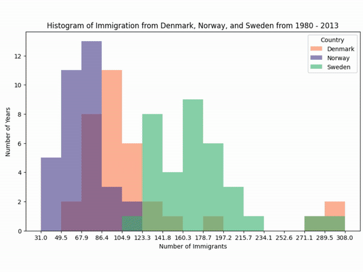

## :man_technologist: About Me

I am an Electronic Instrumentation Engineer currently pursuing a Master's degree in Computing and Electronic Engineering. My expertise spans across Data Science, Machine Learning, and Artificial Intelligence, with a particular focus on digital signal processing (DSP) and emotion recognition from speech.

### Key Skills and Experience:
- **Machine Learning**: Solid foundations in various ML techniques including regression, classification, clustering, and deep learning models such as CNNs, RNNs, Transfer Learning & Fine Tuning.
- **Digital Signal Processing**: Extensive experience in DSP applications, particularly in voice processing and speech emotion recognition.
- **Advanced Techniques**: Proficiency in tools like Wav2vec2, eGeMAPS, HuBERT, Whisper for advanced speech recognition and processing.
- **Data Annotation**: Skilled in using LabelStudio for creating high-quality datasets.
- **Big Data Technologies**: Familiar with Apache Spark and Databricks.
- **Database Management**: Experienced in managing databases with MongoDB, MySQL, and SQL.
- **Computer Vision**: Knowledgeable in using `opencv`, ML algorithms and YOLO for various applications.

- :mailbox: How to reach me: 

---
## Machine Learning

  

- **Knowledge Base**:
  - **Basic Concepts**: Regression, Random Forests, SVM, K-means, KNN, ensemble methods, perceptrons, dimensionality reduction, MLP, CNN (1D, 2D, 3D), RNN, etc.
  - **Advanced Topics**: Transfer learning, active learning, ensemble methods, self-labeling, hybrid networks, non-linear models, GANs, autoencoders.

- **Applications**: 
  - DSP (Imaging and Audio processing), speech emotion recognition, classification, resonant magnetic imaging (fMRI), regression, prediction, dashboards.

- **Tools and Libraries**: 
  - Pytorch, TensorFlow, Scikit-learn, PIL, OpenCV, Dash, **MATLAB** and more.

---

## Data Visualization

  

- **Tools and Libraries**: Extensive experience with dashboards, `matplotlib`, `seaborn`, `plotly`, `folium`, and more.

---

## Computer Vision

  

- **Technologies and Tools**: YOLO, Google DeepDream, LabelStudio, and other advanced computer vision techniques.

---

## :hammer_and_wrench: Languages and Tools

  &nbsp;
  &nbsp;
  &nbsp;
  &nbsp;
  &nbsp;
  &nbsp;
  &nbsp;
  &nbsp;
  &nbsp;
  &nbsp;
  &nbsp;
  &nbsp;
  &nbsp;
  &nbsp;
  &nbsp;
  &nbsp;
  <img src="https://github.com/devicons/devicon/blob/master/icons/arduino/arduin
